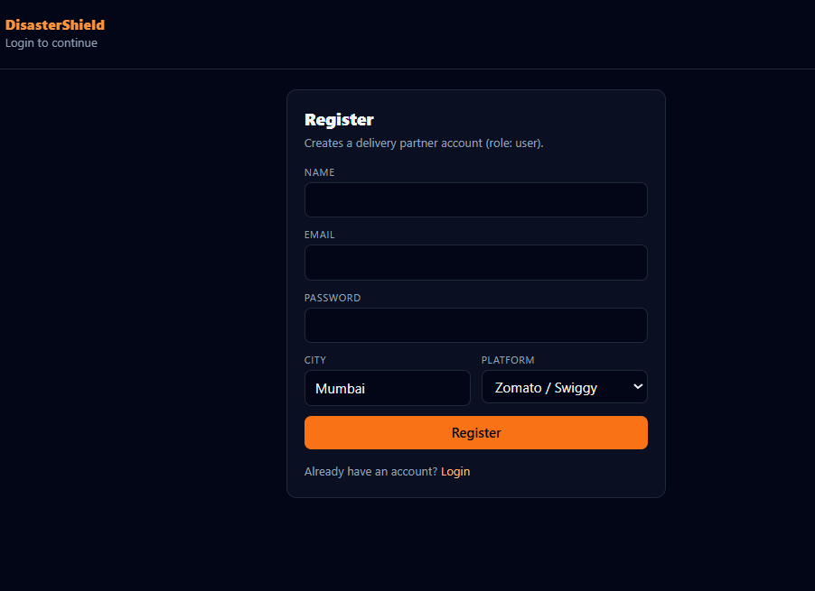
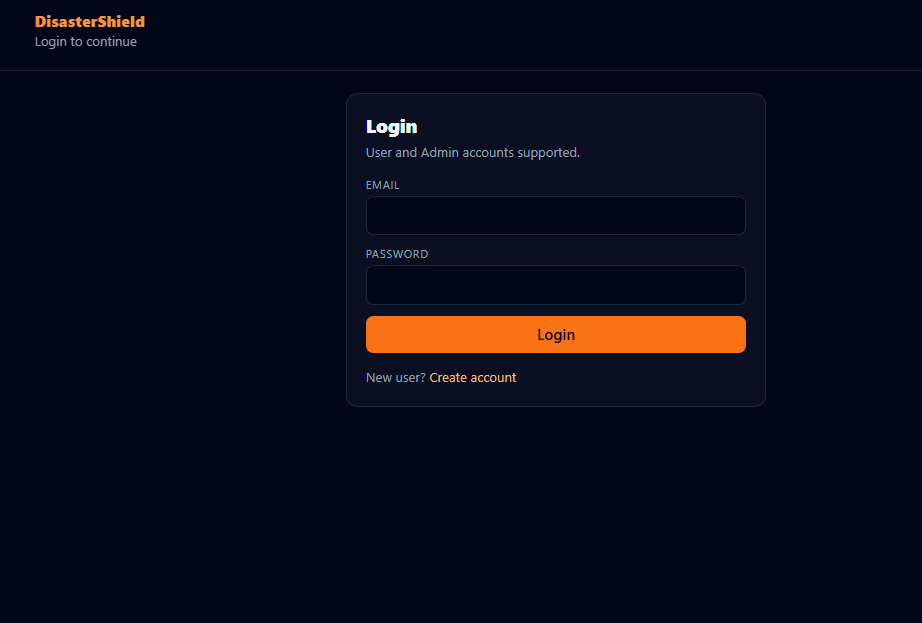

## DisasterShield 
### AI-Powered Parametric Income Protection for Gig Workers (Delivery Partners)

 **Live Demo:** https://disastershield-5-yy00.onrender.com/

 DisasterShield  is a full‑stack **parametric micro‑insurance prototype** that automatically detects real-world disruptions (heavy rain, high pollution, etc.), predicts income loss using **pre‑trained ML models**, and triggers **instant payouts** with a **Trust‑Based Decision Engine**—without manual claim filing.
 
 ### Login / Signup
Users can register or login to the platform easily.




### Worker Dashboard
The dashboard shows risk level, predicted income loss, trigger status, and trust-based payout information.


 

---

## Problem Statement
Delivery partners lose income due to external disruptions (rain, pollution, disasters). Traditional insurance struggles because:
- **Claims are manual and slow**
- **Fraud is easy** (spoofed location, coordinated rings)
- **Decisions are inconsistent**

---

## Our Solution
DisasterShield is a fully automated parametric system:
- Auto‑fetches **live/mocked weather** (no manual rainfall/temp/AQI entry)
- Runs **pre‑trained ML** to score risk and predict income loss
- Detects parametric disruption triggers
- Applies **anti‑spoofing + adversarial fraud defenses**
- Computes payout via a fair **Trust‑Based Decision Engine**
- Persists claims + payouts (Supabase Postgres; local JSON fallback supported)

---

## Key Features
- **Real‑time weather integration** (OpenWeatherMap) with safe mock fallback
- **AI risk scoring + income loss prediction** (pre‑trained models only)
- **Parametric trigger engine** (rules + Isolation Forest)
- **Trust‑Based Decision Engine**: APPROVED / PARTIAL / REJECTED with final payout
- **Fraud detection + anti‑spoofing**
  - GPS reverse‑geocoded city vs selected city
  - rapid claims + repeat attempts escalation
  - spike/cluster ring detection (“market crash defense”)
  - penalty breakdown visible in UI
- **Role‑based authentication**: `user` + `admin` dashboards
- **Persistence**: history survives refresh (claims + transactions)

---

## System Architecture
- **Web UI** (`web/`): React + Tailwind + Recharts dashboards
- **Backend API** (`server/`): Node.js + Express (auth, orchestration, persistence)
- **AI Service** (`ai_service/`): Python FastAPI inference wrapper
- **Models** (`models/`): pre‑trained `.pkl` artifacts + `predict.py`
- **Database** (`supabase/`): Postgres tables + migrations (optional)

---

## Tech Stack
- **Frontend**: React, Tailwind CSS, Recharts, Vite
- **Backend**: Node.js, Express, JWT, Zod, Axios
- **AI Layer**: Python, FastAPI (inference only)
- **Database**: Supabase (PostgreSQL) *(optional)*
- **External APIs**: OpenWeatherMap + reverse geocoding *(optional; mocks always available)*

---

## AI/ML Models (Very Important)
**No training happens in this project.** We only load and run pre‑trained artifacts from `models/`.

### Model artifacts in `models/`
- **`risk_model.pkl`**: predicts disruption **risk level** (Low/Medium/High)
- **`income_loss_model.pkl`**: predicts **income loss** (₹)
- **`isolation_forest.pkl`**: anomaly detector used for trigger validation
- **`fraud_model.pkl`**: fraud/anomaly scoring model
- **`anomaly_scaler.pkl`, `fraud_scaler.pkl`**: scalers for anomaly/fraud models
- **`city_label_encoder.pkl`, `city_le_income.pkl`**: encoders

### Inference entrypoint
All model inference is done via:
- `load_models("./models")`
- `predict_all_api(...)`

Used by the FastAPI service:
- **`POST /predict-all`** (AI service) returns:
  - `risk_level`, `risk_prob_high`
  - `predicted_loss`, `payout_amount`
  - `triggered`, `trigger_score`, `trigger_reasons`
  - `fraud_score`, `fraud_flagged`

---

## Fraud Detection & Market Crash Defense (Very Important)
DisasterShield uses **defense‑in‑depth**: the ML fraud score is enhanced with real-world and adversarial signals.

### 1) Location mismatch detection (Anti‑spoofing)
- Frontend captures GPS via `navigator.geolocation` → sends `lat/lon`
- Backend reverse‑geocodes to `detected_city`
- If `detected_city != selected_city`:
  - `fraud_signals.location_mismatch = true`
  - **Penalty +0.4** added to final fraud score

### 2) Repeat fraud tracking (Persisted)
- Tracks prior user behavior (DB or local store):
  - rejected claims threshold → `repeat_fraud = true`
  - `users.fraud_count`, `users.last_claim_time` updated
  - **Penalty +0.3**

### 3) Rapid claim attempts
- Multiple claims in a short window → `rapid_claims = true`
- **Penalty +0.2**

### 4) Fraud rings & claim spikes
- **abnormal_claim_spike**: many claims within a few minutes
- **identical_behavior_cluster**: many users with identical patterns
- **repeated_trigger_claims**: repeated triggered attempts by the same user

### 5) Enhanced fraud score
Final score used for payout decisions:

$$
enhanced\_fraud\_score = clamp01(model\_fraud\_score + penalties)
$$

### 6) Trust‑Based Decision Engine (fairness preserved)
Instead of blanket rejection:
- **APPROVED**: trust ≥ 0.7 → full payout
- **PARTIAL**: trust ≥ 0.4 → payout × 0.6; if triggered but low trust → payout × 0.4
- **REJECTED**: trust < 0.4 and not triggered

---

## How It Works (Step‑by‑Step)
1. User registers / logs in
2. User clicks **Check Risk**
3. Backend:
   - uses city + GPS (`lat/lon`) to detect spoofing
   - fetches live weather (or mock fallback)
   - simulates delivery drop
4. Backend calls AI service `/predict-all`
5. Fraud defenses + trust decision engine compute:
   - `decision`, `trust_score`, `final_payout`, `reason`
6. Saves claim + transaction to DB (Supabase) or local JSON
7. Dashboard fetches history on load → **refresh does not lose data**

---

## Installation & Setup
### Prerequisites
- Node.js (LTS recommended)
- Python 3.10+

### 1) Clone repo
```bash
git clone <your-repo-url>
cd DisasterShield 
```

### 2) Install dependencies
#### AI service (Python)
```bash
pip install -r ai_service/requirements.txt
```

#### Backend (Node)
```bash
cd server
npm install
```

#### Frontend (React)
```bash
cd web
npm install
```

### 3) Environment variables
#### Backend (`server/`)
Required (AI):
- `AI_URL=http://127.0.0.1:9000`
- `JWT_SECRET=...`

Optional (for “real” APIs & DB):
- `SUPABASE_URL=...`
- `SUPABASE_SERVICE_ROLE_KEY=...`
- `OPENWEATHER_API_KEY=...`
- `OPENCAGE_API_KEY=...`

Template: `server/env.example.txt`

#### Frontend (`web/`)
- `VITE_API_URL=http://127.0.0.1:8000`

Template: `web/env.example.txt`

### 4) Run (3 terminals)
#### Terminal A — AI service (FastAPI)
```bash
uvicorn ai_service.main:app --reload --host 127.0.0.1 --port 9000
```

#### Terminal B — Backend (Express)
```bash
cd server
set AI_URL=http://127.0.0.1:9000
npm run dev
```

#### Terminal C — Frontend (Vite)
```bash
cd web
set VITE_API_URL=http://127.0.0.1:8000
npm run dev
```

Open: `http://127.0.0.1:5173`

---

## API Usage
### Auth
- **POST** `/api/auth/register`
- **POST** `/api/auth/login`
- **GET** `/api/auth/me` *(Bearer token)*

### Analyze (automated parametric evaluation)
- **POST** `/api/analyze` *(user-only, Bearer token)*

Example request:
```json
{
  "city": "Mumbai",
  "lat": 19.0760,
  "lon": 72.8777,
  "expected_income": 5000
}
```

### History (persistence)
- **GET** `/api/claims/:user_id`
- **GET** `/api/transactions/:user_id`

---

## Frontend Overview
### Worker Dashboard
- Risk level, premium, predicted loss, trigger status
- Trust score meter + final payout + reason
- Fraud alerts + penalty breakdown + detected city
- Past claims table + total payout saved (persists on refresh)

### Admin Dashboard
- Fraud alerts, payout totals, city risk visualization (demo)

---

## Backend Overview
Key modules:
- `server/services/weatherService.js`: live weather (OpenWeather) + mock fallback
- `server/services/locationService.js`: reverse geocoding + anti-spoofing
- `server/services/decisionEngine.js`: trust score → decision → final payout
- `server/localStore.js`: local JSON persistence fallback

---

## Database Schema (Basic)
Core tables:
- `users`: name, email, password_hash, role, city, platform, fraud_count, last_claim_time
- `claims`: ML outputs + fraud signals + penalties + decision + final payout
- `transactions`: payout records linked to claims

Schema and migrations:
- `supabase/schema.sql`
- `supabase/migrations/*.sql`

---

## Demo Instructions (Judges)
1. Register a user and login
2. Allow GPS permissions
3. Click **Check Risk**
4. Show:
   - weather auto-fetch
   - trigger + ML outputs
   - fraud penalties applied (try city mismatch)
   - trust decision + final payout
5. Refresh → history remains visible

---

## Future Improvements
- Real delivery/drop data integration (platform APIs)
- Better fraud ring clustering (graph/community detection)
- Supabase RLS policies for production-grade multi-tenant security
- Real payment rails integration (UPI/bank transfer)
