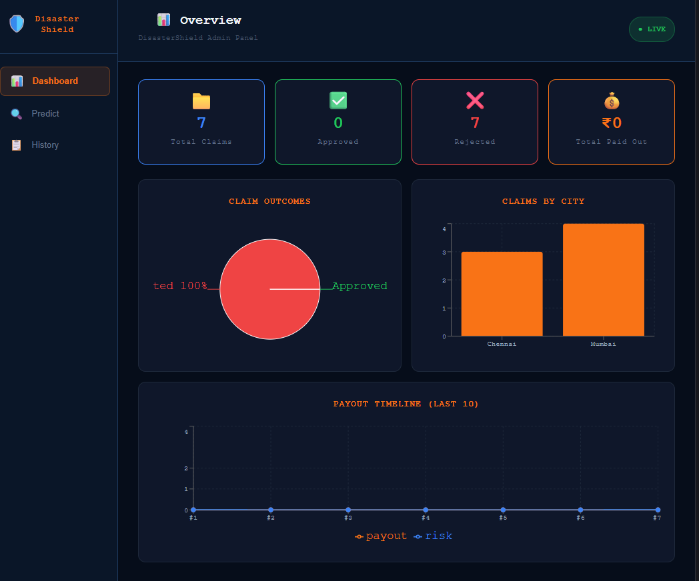

 

# DisasterShield

### AI-Powered Parametric Income Protection for Gig Workers (Delivery Partners)

**Live Demo:** [https://disastershield-5-yy00.onrender.com/](https://disastershield-5-yy00.onrender.com/)
**Youtube Video:** [https://youtu.be/4tYqDzg-guk?si=To1lQiwU42SJiomD](https://youtu.be/4tYqDzg-guk?si=To1lQiwU42SJiomD)

DisasterShield is a full-stack **parametric micro-insurance prototype** designed to protect gig workers from income shocks caused by real-world disruptions such as heavy rainfall, pollution spikes, or extreme conditions.

Instead of manual claims, the system uses **pre-trained machine learning models + real-time signals** to automatically assess risk and trigger **instant, fair payouts** using a **Trust-Based Decision Engine**.

---

## Product Walkthrough

### Login / Signup

Users can quickly onboard and access the system.

---

### Worker Dashboard

The dashboard provides a complete overview of:

* Risk level
* Predicted income loss
* Trigger status
* Trust score and final payout

---

## Problem Statement

Delivery partners lose income due to external disruptions (rain, pollution, disasters). Traditional insurance systems fail because:

* Claims are **manual and slow**
* Fraud is **easy and scalable** (GPS spoofing, coordinated rings)
* Decisions are often **inconsistent and opaque**

---

## Our Solution

DisasterShield reimagines insurance as an **automated, AI-driven system**:

* Automatically fetches **live or fallback weather data**
* Uses **pre-trained ML models** for risk and income prediction
* Detects **parametric triggers** (no manual claim input)
* Applies **multi-layer fraud detection and anti-spoofing**
* Computes payouts using a **Trust-Based Decision Engine**
* Persists claims and transactions reliably

---

## Key Features

* Real-time weather integration with fallback support
* AI-driven **risk scoring + income loss prediction**
* Parametric trigger detection (rules + anomaly models)
* Trust-Based payout decisions: APPROVED / PARTIAL / REJECTED
* Advanced fraud detection:

  * GPS vs detected city validation
  * Rapid and repeated claims tracking
  * Claim spike and fraud ring detection
* Role-based dashboards (user + admin)
* Persistent claim history (no data loss on refresh)

---

## Adversarial Defense & Anti-Spoofing Strategy (Critical Upgrade)

### The Problem We Solved

Modern fraud is **coordinated and adversarial**. A group of users can spoof GPS locations simultaneously and drain the system.

DisasterShield is built to **detect behavior, not just location**.

---

### 1) Differentiation: Real Worker vs Spoofed Actor

We use a **multi-signal trust model**, not a single GPS check.

$$
trust\_score = 1 - enhanced\_fraud\_score
$$

A genuine worker shows:

* Natural movement patterns
* Irregular claim timing
* Realistic interaction delays

A spoofed actor shows:

* Perfect/static GPS
* Synchronized claims
* Identical behavior across users

---

### 2) Data Beyond GPS (Key Innovation)

To detect fraud rings, we analyze:

#### Behavioral Signals

* Claim frequency
* Interaction timing
* Session activity

#### Temporal Signals

* Claim clustering in short windows
* Sudden spikes across users

#### Environmental Correlation

* Weather vs actual impact consistency
* Trigger validity over time

#### Device & Network Signals

* IP vs GPS mismatch
* Device consistency patterns

#### Graph-Based Fraud Detection

We model users as a **network graph**:

* Nodes → users
* Edges → behavioral similarity

Fraud rings form **dense clusters with identical behavior**, making them detectable.

---

### 3) UX Balance: Fairness for Honest Workers

We avoid harsh rejection and use **progressive trust handling**:

* **High Trust (≥ 0.7)** → Full payout
* **Medium Trust (0.4–0.7)** → Partial payout
* **Low Trust (< 0.4)** → Flagged (not blindly rejected)

#### Why this matters:

* Real users may face **network drops during bad weather**
* System allows **grace tolerance**
* Ensures **fairness + user trust**

Users also see:

* Fraud signals
* Penalty breakdown
* Reason for decisions

---

### 4) Why This Survives the Attack Scenario

In a coordinated attack:

* 500 users spoof same location

Our system detects:

* Synchronized timestamps
* Identical behavior patterns
* Lack of movement variation
* Dense fraud clusters

Result:

* Trust scores drop collectively
* Payouts reduced or blocked
* Liquidity pool protected

---

## System Architecture

* **Frontend**: React + Tailwind + Recharts
* **Backend**: Node.js + Express
* **AI Service**: FastAPI (Python)
* **Models**: Pre-trained `.pkl` files
* **Database**: Supabase (optional)

---

## Tech Stack

* React, Tailwind CSS, Recharts
* Node.js, Express, JWT
* Python, FastAPI
* Supabase (PostgreSQL)
* OpenWeatherMap APIs

---

## AI/ML Models

No training is done in this system—only inference using pre-trained models:

* Risk prediction
* Income loss prediction
* Fraud scoring
* Anomaly detection

---

## How It Works

1. User logs in
2. Clicks **Check Risk**
3. System fetches weather + validates GPS
4. AI service predicts risk, loss, fraud
5. Decision engine computes payout
6. Data is stored and shown in dashboard

---

## Challenges We Faced

* Designing **fraud-resistant architecture under time pressure**
* Handling **coordinated spoofing attacks**
* Balancing **security vs fairness**
* Managing **multi-service integration (Frontend + Backend + AI)**

---

## What We’re Proud Of

* End-to-end working **AI-powered insurance prototype**
* Real-time **decision-making system**
* Strong **fraud and adversarial defense design**
* Clean and intuitive **user experience**

---

## What We Learned

* Real-world systems must assume **adversarial users**
* AI is powerful only when combined with **system design**
* Fraud detection is about **patterns, not single signals**
* Good UX is critical even in high-risk systems

---

## Future Improvements

* Real delivery platform integrations
* Advanced graph-based fraud detection
* Production-grade security policies
* Real payment integrations (UPI/bank transfers)

---

## Demo Instructions (Judges)

1. Register and login
2. Allow GPS
3. Click **Check Risk**
4. Observe:

   * Weather auto-fetch
   * ML predictions
   * Fraud detection signals
   * Final payout decision
5. Refresh → data persists

---

## Final Note

DisasterShield is not just an insurance prototype.

It is a **resilient, adversarial-aware system** that answers a critical question:
How do you build financial protection systems when users themselves can try to game the system?
 
